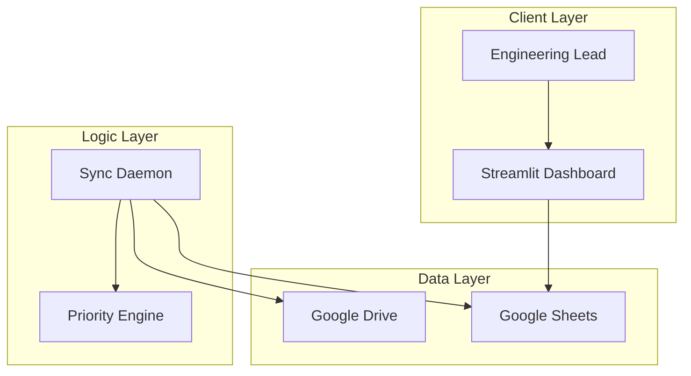

# Keystone: Architect Review Dashboard 🏗️

[](https://www.python.org/downloads/)
[](https://streamlit.io/)
[](https://developers.google.com/drive)
[](https://opensource.org/licenses/MIT)

> **Zero-friction document review tracking for high-velocity engineering teams.**

**Keystone** is a real-time "Command Center" for Engineering Design Reviews (EDRs). It empowers engineering leads and architects to solve the "Google Doc Purgatory" problem by automatically syncing, scoring, and visualizing technical reviews directly from your Google Drive workforce.


---

## 🚨 The Problem

In fast-paced engineering teams, Design Reviews are critical but often chaotic:

*   **Lost Links:** Critical review requests get buried in Slack threads or infinite Email chains.
*   **Zero Visibility:** Managers lack a birds-eye view of which 20+ documents are "Pending" vs "Approved."
*   **Stagnation:** Important architectural decisions sit unreviewed for weeks because they are out of sight.
*   **Context Switching:** Architects hate updating Jira tickets; they just want to work in Google Docs.

## 💡 The Solution

Keystone provides a **zero-friction layer** over your existing workflow:

1.  **Auto-Discovery:** A background daemon watches your Google Drive. **No manual entry required.**
2.  **Priority Engine:** Algorithms calculate a "Urgency Score" based on document age and inactivity.
3.  **Dual Interface:**
    *   *Architects:* Continue working in Google Docs (no new tool to learn).
    *   *Managers:* Use the Keystone Dashboard to visualize bottlenecks and SLA breaches.

---

## 🏗️ System Architecture

The system operates on a "Hub and Spoke" model with Google Sheets acting as the high-availability metadata database.



---

## 🛠️ Tech Stack

*   **Frontend:** [Streamlit](https://streamlit.io/) (Python-based UI framework)
*   **Backend:** Python 3.10+
*   **Database:** Google Sheets (via `gspread`)
*   **APIs:** Google Drive API v3, Google Sheets API v4
*   **Analytics:** Plotly Express for interactive visualization
*   **Scheduling:** APScheduler for background synchronization

---

## 🚀 Key Features

### 🧠 The Priority Engine
Keystone doesn't just list files; it ranks them.
**Formula:** `Priority Score = (Days Since Creation) + (Days Since Last Edit)`

*   🔴 **CRITICAL (Score > 10):** Immediate attention needed.
*   🟡 **HIGH (Score 5-10):** Approaching SLA breach.
*   🟢 **NORMAL (Score < 5):** On track.

### 🔄 Bi-Directional Sync
*   **Drive -> Dashboard:** New files created in Drive appear in the dashboard automatically.
*   **Dashboard -> Sheets:** Status changes (e.g., "Approved") made in the UI are written back to the central database instantly.

### 📊 Operational Analytics
*   **Queue Health:** Real-time distribution of Pending vs. Completed reviews.
*   **Stagnation Timeline:** A scatter plot identifying "stale" reviews (large bubbles = old docs).
*   **Workload Balancing:** See which architect is overloaded with pending reviews.

---

## ⚙️ Installation & Setup

### Prerequisites
*   Python 3.8 or higher
*   A Google Cloud Project with **Drive** & **Sheets** APIs enabled

### 1. Clone the Repository
```bash
git clone https://github.com/anu-kx04/ZYNGA-FILE-REVIEW-SYSTEM.git
cd ZYNGA-FILE-REVIEW-SYSTEM
```

### 2. Environment Setup

**Create virtual environment**
```bash
python -m venv venv
```

**Activate it**
*   Windows: `.\venv\Scripts\activate`
*   Mac/Linux: `source venv/bin/activate`

**Install dependencies**
```bash
pip install -r requirements.txt
```

### 3. Configuration
1.  Place your Google Cloud Credentials (`credentials.json`) in the root folder.
2.  Create a `config.json` file in the root folder:

```json
{
    "google": {
        "sheet_id": "YOUR_GOOGLE_SHEET_ID_HERE"
    },
    "sync": {
        "interval_minutes": 15
    }
}
```

### 4. Run the System
You need two terminal windows running simultaneously.

**Terminal 1: The Backend (Sync Daemon)**
```bash
python sync_daemon.py
```
*Logs will appear showing Drive scan status.*

**Terminal 2: The Frontend (Dashboard)**
```bash
streamlit run app.py
```
*Opens automatically in your browser at http://localhost:8501*

---

## 🤝 Contributing

Contributions are always welcome!

1.  Fork the Project
2.  Create your Feature Branch (`git checkout -b feature/AmazingFeature`)
3.  Commit your Changes (`git commit -m 'Add some AmazingFeature'`)
4.  Push to the Branch (`git push origin feature/AmazingFeature`)
5.  Open a Pull Request

---

## 👤 Author

**Anushka Singh**
*   **GitHub:** [@anu-kx04](https://github.com/anu-kx04)
*   **University:** PES University

---

*Made with ❤️ for efficient engineering.*
